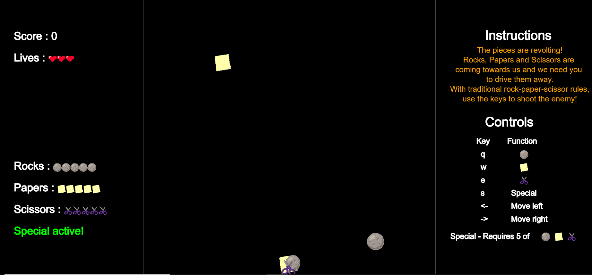
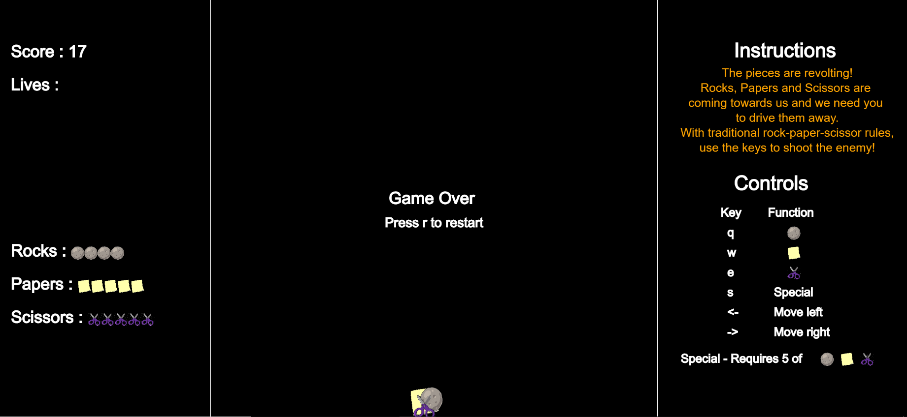
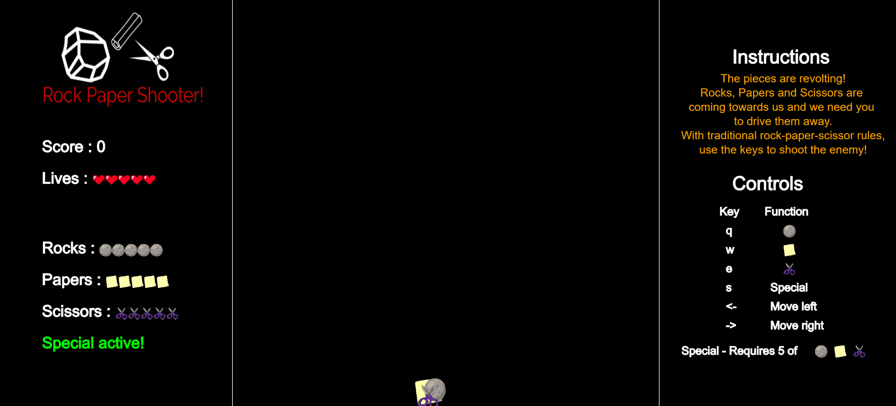

  
  
   
  
  
  
   
  
  

# Rock Paper Shooter
A game of rock paper scissors, with a twist!

There's a rebellion on our hands! We need your help in defending the realm.

[Play here](https://vtg2000.itch.io/rock-paper-shooter)

---
## Screenshots

---
# Contributors
This project was created as part of the <b>itch.io Weekly Game Jam</b> by

Anay Kulkarni - [anay121](https://github.com/Anay121)

Vignesh Viswanathan - [vtg2000](https://github.com/vtg2000)

---

### License
This project is licensed under the MIT - check out the [LICENSE](./LICENSE.txt) file for details.
